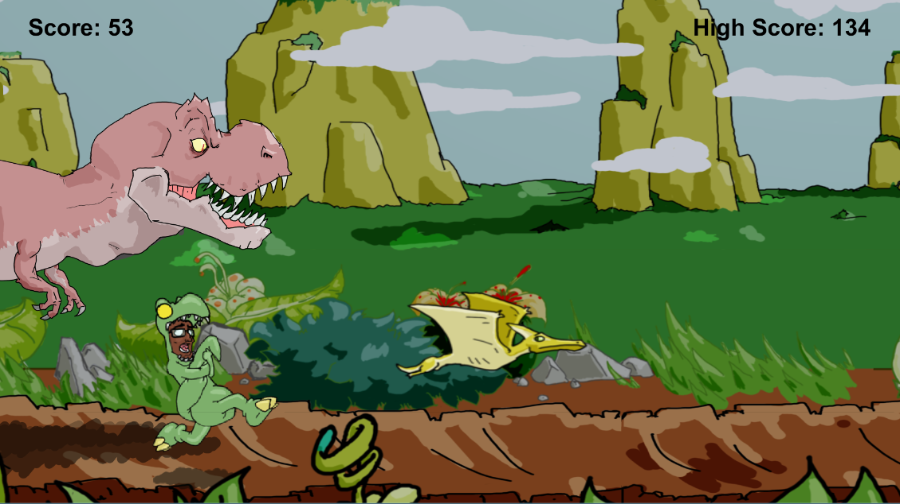

# DinoRun
may change this name

Aquarium Project

## Overview
Project made to learn how to make a game as a team.
The project is a simple infinity run where the main character went back to the past and now he is running for his life.

## TODO
* Visual effects
	* Create a dust image to do in particles
	* Make a function to activate and deactivate the particle system
* Reorganize the render layers
* Game Icon
* Splash art
* Logo
* SFX
* Change the name

## Bugs
* Hit trunk is missing
* Sometimes when try to hit a enemy, doesn't hit or hit but still hitted by the enemy

## Need to Improve
* Collision with the enemy
* Delay to atk again

## Authors
* **João Vitor Filgueira Albuquerque** - [jv-albuquerque](https://github.com/jv-albuquerque)
* **Samir Rodrigues** - [SamirRodrigues](https://github.com/SamirRodrigues)